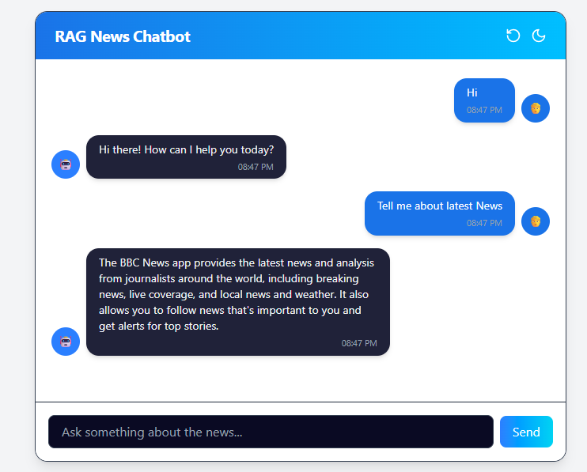
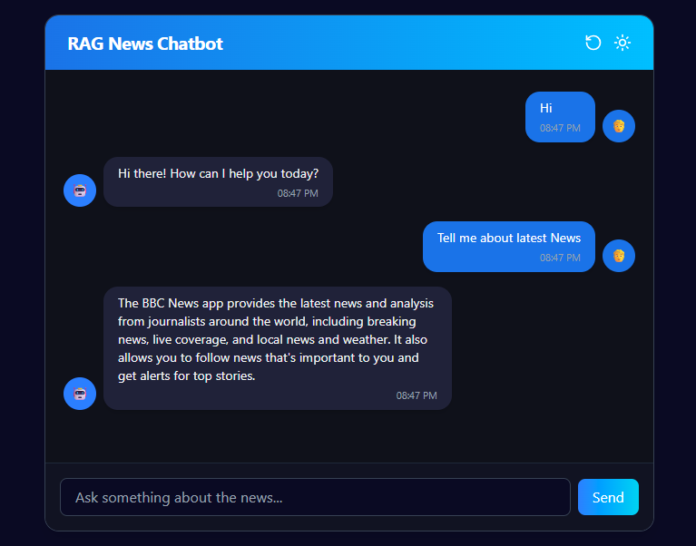

# RAG News Chatbot – Frontend

This is the frontend for the RAG-powered chatbot that allows users to interact with news data intelligently. It’s built with **React**, styled using **Tailwind CSS**, and deployed on **Vercel**.

---

## 🚀 Live Demo

🔗 [Click to Try the Chatbot](https://rag-chatbot-frontend-sage.vercel.app/)


---

## 🧱 Tech Stack

- **React (Hooks)** – Modern, component-based frontend
- **Tailwind CSS** – Utility-first CSS for fast styling
- **Vite** – Lightning-fast dev server and build tool
- **Hosted on Vercel**

---

## ✨ Features

- Responsive chat UI
- Dark mode toggle
- Message timestamps
- Reset session button
- Typing indicator while fetching response
- Scroll-to-latest message support

---

## 🧩 Component Structure

```
src/
├── components/
│   ├── ChatHeader.jsx       # Header with dark mode & reset
│   ├── ChatList.jsx         # Message display area
│   ├── ChatInput.jsx        # Input + Send button
│   └── ChatMessageBubble.jsx # Individual chat bubble
├── App.jsx                  # Main container
├── App.css                  # Typing animation styles
```

---

## 🔗 Backend Integration

Connected to a FastAPI backend via REST APIs:

- `GET /session` → create a new session
- `GET /history/:session_id` → load past messages
- `POST /chat` → send user query and get reply
- `POST /reset/:session_id` → reset session history

> Ensure CORS is allowed from the frontend domain.

---

## 🛠 Local Setup

```bash
# Install dependencies
npm install

# Start development server
npm run dev
```

---

## 🖼 Screenshots

> Add your screenshots in a `/screenshots` folder and reference them here.


### Chat UI (Light Mode)


### Chat UI (Dark Mode)

---

## 🌐 Deployment

We recommend using **Vercel**:

```bash
vercel --prod
```

Make sure environment variables (if any) are configured in Vercel settings.

---

## 📬 Contact

Reach out to: [agarg1107@gmail.com](mailto:agarg1107@gmail.com)
